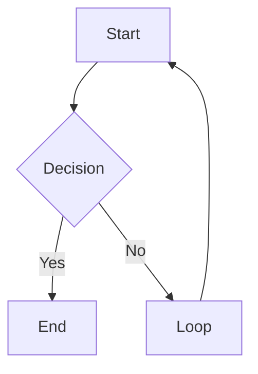

# obsidian-markdown: Obsidian Flavored Markdown

Reference this skill when writing any wiki page. Obsidian extends standard Markdown with wikilinks, embeds, callouts, and properties. Getting syntax wrong causes broken links, invisible callouts, or malformed frontmatter.

**Cross-reference**: If the kepano/obsidian-skills plugin is installed, prefer its canonical obsidian-markdown skill for authoritative Obsidian syntax reference. Otherwise, use the reference below. See also [github.com/kepano/obsidian-skills](https://github.com/kepano/obsidian-skills).

**Vault content model**: Root `AGENTS.md` is authoritative. Each source or session remains one atomic note under `wiki/sources/`; relationship metadata belongs in `wiki/meta/notes-graph.md`. Syntax examples below do not authorize creating extra content pages.

---

## Wikilinks

Internal links use double brackets. The filename without extension.

| Syntax | What it does |
|---|---|
| `[[Note Name]]` | Basic link |
| `[[Note Name\|Display Text]]` | Aliased link (shows "Display Text") |
| `[[Note Name#Heading]]` | Link to a specific heading |
| `[[Note Name#^block-id]]` | Link to a specific block |

Rules:
- Case-sensitive on some systems. Match the exact filename.
- No path needed: Obsidian resolves by filename uniqueness.
- If two files have the same name, use `[[Folder/Note Name]]` to disambiguate.

---

## Embeds

Embeds use `!` before the wikilink. They display the content inline.

| Syntax | What it does |
|---|---|
| `![[Note Name]]` | Embed a full note |
| `![[Note Name#Heading]]` | Embed a section |
| `![[image.png]]` | Embed an image |
| `![[image.png\|300]]` | Embed image with width 300px |
| `![[document.pdf]]` | Embed a PDF (Obsidian renders natively) |
| `![[audio.mp3]]` | Embed audio |

---

## Callouts

Callouts are blockquotes with a type keyword. They render as styled alert boxes.

```markdown
> [!note]
>
> Default informational callout.

> [!note] Custom Title
>
> Callout with a custom title.

> [!note]- Collapsible (closed by default)
>
> Click to expand.

> [!note]+ Collapsible (open by default)
>
> Click to collapse.
```

### All callout types

| Type | Aliases | Use for |
|------|---------|---------|
| `note` |: | General notes |
| `abstract` | `summary`, `tldr` | Summaries |
| `info` |: | Information |
| `todo` |: | Action items |
| `tip` | `hint`, `important` | Tips and highlights |
| `success` | `check`, `done` | Positive outcomes |
| `question` | `help`, `faq` | Open questions |
| `warning` | `caution`, `attention` | Warnings |
| `failure` | `fail`, `missing` | Errors or failures |
| `danger` | `error` | Critical issues |
| `bug` |: | Known bugs |
| `example` |: | Examples |
| `quote` | `cite` | Quotations |
| `contradiction` |: | Conflicting information (wiki convention) |

---

## Properties (Frontmatter)

Obsidian renders YAML frontmatter as a Properties panel. Rules:

```yaml
---
type: source                     # one atomic source note
source_type: web
title: "Note Title"              # quoted if it contains special chars
created: 2026-04-08              # date as YYYY-MM-DD (not ISO datetime)
updated: 2026-04-08
tags:
  - tag-one                      # list items use - format
  - tag-two
status: developing
related:
  - "[[Other Note]]"             # wikilinks must be quoted in YAML
raw_path:
  - .raw/webfetch/2026-04-08_example_article.md
provenance:
  schema: v1
  model: <model-id>
  derived: false
  recorded: 2026-04-08
  verified:
    - raw-archived
    - web-fetch
---
```

Rules:
- Keep ordinary fields flat; the required `provenance` block is intentionally nested.
- Dates as `YYYY-MM-DD`, not `2026-04-08T00:00:00`.
- Lists as `- item`, not inline `[a, b, c]`.
- Wikilinks in YAML must be quoted: `"[[Page]]"`.
- `tags` field: Obsidian reads this as the tag list, searchable in vault.
- Only list verification methods actually used in `provenance.verified`.
- Long string fields must not nest the same quote style. Use different inner quotes, Chinese full-width quotes, or a YAML block scalar.

Every organized, merged, or synthesis note starts with a 100–200 Chinese-character `> [!abstract] 摘要` after the first `#` heading. In any callout, leave a blank `>` line between the title, paragraphs, and lists so Obsidian mobile does not merge them into one block.

---

## Tags

Two valid forms:

```markdown
#tag-name             : inline tag anywhere in the body
#parent/child-tag     : nested tag (shows hierarchy in tag pane)
```

In frontmatter:
```yaml
tags:
  - research
  - ai/obsidian
```

Do not use `#` inside frontmatter tag lists. Just the tag name.

---

## Text Formatting

Standard Markdown plus Obsidian extensions:

| Syntax | Result |
|---|---|
| `**bold**` | Bold |
| `*italic*` | Italic |
| `~~strikethrough~~` | Strikethrough |
| `==highlight==` | Highlighted text (yellow in Obsidian) |
| `` `inline code` `` | Inline code |

---

## Math

Obsidian uses MathJax/KaTeX:

Inline math:
```markdown
$E = mc^2$
```

Block math:
```markdown
$$
\int_0^\infty e^{-x} dx = 1
$$
```

---

## Code Blocks

Standard fenced code blocks. Obsidian highlights all common languages:

````markdown
```python
def hello():
    return "world"
```
````

---

## Tables

Standard Markdown tables:

```markdown
| Column A | Column B | Column C |
|----------|----------|----------|
| Value    | Value    | Value    |
| Value    | Value    | Value    |
```

Obsidian renders tables natively. No plugin needed.

---

## Mermaid Diagrams

Obsidian renders Mermaid natively:

````markdown

````

Supported: `graph`, `sequenceDiagram`, `gantt`, `classDiagram`, `pie`, `flowchart`.

---

## Footnotes

```markdown
This sentence has a footnote.[^1]

[^1]: The footnote text goes here.
```

---

## What NOT to Do

- Do not use `[link text](path/to/note.md)` for internal links: use `[[Note Name]]` instead.
- Do not use HTML inside callouts: stick to Markdown.
- Do not use `##` inside a callout body: headings don't render inside callouts.
- Do not write `tags: [a, b, c]` inline in frontmatter: Obsidian prefers the list format.
- Do not write ISO datetimes in frontmatter (`2026-04-08T00:00:00Z`): use `2026-04-08`.


## 宿主适配

先读根 AGENTS.md。使用宿主实际提供的文件、搜索、网页和连接器工具；本文的 Claude 工具名与斜杠命令表示能力或意图，不要求在 WorkBuddy 安装同名工具。缺少自动 skill 发现时，直接按相对路径读取本文件。
